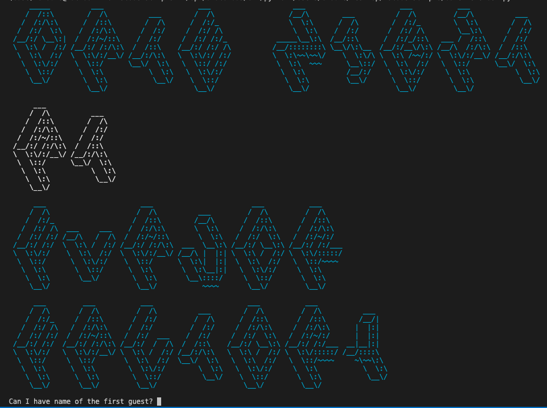

# catalog of Build Scripts and in-class activities

## A Date to Remember
- In-Class activity - Python script 
- Practice using various Python data types (lists, dictionaries, etc)
- Practice accepting user input
- Manipulating user input to for dynamic functionality

## AWS EC2 + Jenkins   
- Bash script to automate Jenkins installation on EC2 instance at launch
